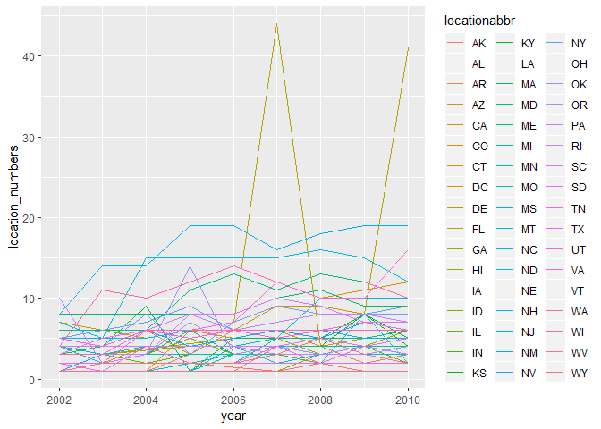
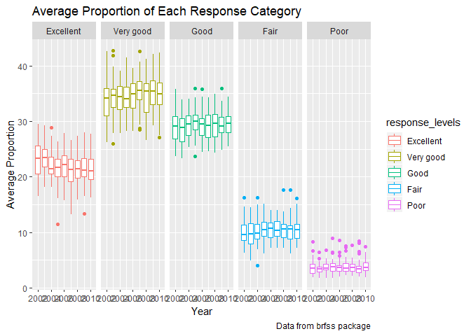

p8105\_HW3\_bjl2150
================
Briana Lettsome
October 15, 2018

``` r
# Loading of tidyverse package
library(tidyverse)
```

    ## -- Attaching packages --------------------------------------------------------------------------- tidyverse 1.2.1 --

    ## v ggplot2 3.0.0     v purrr   0.2.5
    ## v tibble  1.4.2     v dplyr   0.7.6
    ## v tidyr   0.8.1     v stringr 1.3.1
    ## v readr   1.1.1     v forcats 0.3.0

    ## -- Conflicts ------------------------------------------------------------------------------ tidyverse_conflicts() --
    ## x dplyr::filter() masks stats::filter()
    ## x dplyr::lag()    masks stats::lag()

Problem 1
=========

``` r
# install.packages("devtools")
devtools::install_github("p8105/p8105.datasets")
```

    ## Skipping install of 'p8105.datasets' from a github remote, the SHA1 (21f5ad1c) has not changed since last install.
    ##   Use `force = TRUE` to force installation

``` r
library(p8105.datasets)


data(brfss_smart2010)
  
brfss = brfss_smart2010 %>% 
  janitor::clean_names() %>%
  filter(topic == "Overall Health")

# Checked the unique observations within 'response' columns
unique(brfss$response)
```

    ## [1] "Excellent" "Very good" "Good"      "Fair"      "Poor"

``` r
# Ordering of the responses from "Excellent"" to "Poor"
brfss %>%
  mutate(response_levels = forcats::fct_relevel(response, c("Excellent", 
                                                            "Very good", "Good",
                                                            "Fair", "Poor")))
```

    ## # A tibble: 10,625 x 24
    ##     year locationabbr locationdesc class topic question response
    ##    <int> <chr>        <chr>        <chr> <chr> <chr>    <chr>   
    ##  1  2010 AL           AL - Jeffer~ Heal~ Over~ How is ~ Excelle~
    ##  2  2010 AL           AL - Jeffer~ Heal~ Over~ How is ~ Very go~
    ##  3  2010 AL           AL - Jeffer~ Heal~ Over~ How is ~ Good    
    ##  4  2010 AL           AL - Jeffer~ Heal~ Over~ How is ~ Fair    
    ##  5  2010 AL           AL - Jeffer~ Heal~ Over~ How is ~ Poor    
    ##  6  2010 AL           AL - Mobile~ Heal~ Over~ How is ~ Excelle~
    ##  7  2010 AL           AL - Mobile~ Heal~ Over~ How is ~ Very go~
    ##  8  2010 AL           AL - Mobile~ Heal~ Over~ How is ~ Good    
    ##  9  2010 AL           AL - Mobile~ Heal~ Over~ How is ~ Fair    
    ## 10  2010 AL           AL - Mobile~ Heal~ Over~ How is ~ Poor    
    ## # ... with 10,615 more rows, and 17 more variables: sample_size <int>,
    ## #   data_value <dbl>, confidence_limit_low <dbl>,
    ## #   confidence_limit_high <dbl>, display_order <int>,
    ## #   data_value_unit <chr>, data_value_type <chr>,
    ## #   data_value_footnote_symbol <chr>, data_value_footnote <chr>,
    ## #   data_source <chr>, class_id <chr>, topic_id <chr>, location_id <chr>,
    ## #   question_id <chr>, respid <chr>, geo_location <chr>,
    ## #   response_levels <fct>

### Question 1.1

``` r
#Wrangling dataframe to find the which states were observed at 7 locations
brfss_2002 = brfss %>%
  filter(year == 2002) %>%
  separate(locationdesc, into = c("state", "county"), sep = "-") %>%
  group_by(state) %>%
  distinct(county) %>%
  count() %>%
  filter(n == 7)
```

    ## Warning: Expected 2 pieces. Additional pieces discarded in 5 rows [121,
    ## 122, 123, 124, 125].

Conecticut, Florida and North Carolina are the states which were observed at 7 locations

Question 1.2: Making of Spaghetti Plot
--------------------------------------

``` r
library(ggridges)
```

    ## 
    ## Attaching package: 'ggridges'

    ## The following object is masked from 'package:ggplot2':
    ## 
    ##     scale_discrete_manual

``` r
# Wanted to see the unique year observations within the dataset
unique(brfss_smart2010$Year)
```

    ## [1] 2010 2009 2008 2007 2006 2005 2004 2003 2002

``` r
# Making of the spaghetti plot
brfss_spaghetti = brfss %>%
  group_by(locationabbr, year) %>%
  distinct(locationdesc) %>%
  summarize(location_numbers = n()) %>%
  ggplot(aes(x = year, y = location_numbers, color = locationabbr)) + 
  geom_line() 

# Calling of the datset in order to show the plot.
brfss_spaghetti
```

 In the above code chunk, library(ggridges) was loaded in order for plot to be properly displayed. The unique function was used to identify the unique years that are included wihtin the dataset. In making the spaghetti plot, data was first grouped by locationabbr and year columns. The distinct function was then used on locationdesc to get the specific locations within each state. The summarize was used to obtain the numbers of locations within esch state. A spaghetti plot was then used to show the number of locations in each state from 2002 through 2010.

### Question 1.3: Making of Table

``` r
# Using filter and spread functions to obtain the proportion of "Excellent" responses
brfss_table_1 = brfss %>%
    filter(locationabbr == "NY", response == "Excellent") %>%
  spread(key = response, value = data_value) %>%
  filter(year %in% c("2002", "2006", "2010")) 

# Making of the table to show means and standard deviations
brfss_table_1 %>%
  group_by(year) %>%
  summarize(mean_excellent = mean(Excellent),
            sd_excellent = sd(Excellent)) %>%
   knitr::kable(digits = 1)
```

|  year|  mean\_excellent|  sd\_excellent|
|-----:|----------------:|--------------:|
|  2002|             24.0|            4.5|
|  2006|             22.5|            4.0|
|  2010|             22.7|            3.6|

### Question 4

``` r
brfss_4 = brfss %>%
  mutate(response_levels = forcats::fct_relevel(response, c("Excellent",  
                                                            "Very good", "Good", 
                                                            "Fair", "Poor"))) %>%
  select(year, locationabbr, data_value, response_levels) %>%
  group_by(response_levels, locationabbr, year) %>%
  summarize(avg_response = mean(data_value))

brfss_4 %>%
    ggplot(aes(x = year, y = avg_response, group = year, color = response_levels)) +
  geom_boxplot() + 
  facet_grid(~response_levels) + 
  viridis::scale_fill_viridis(discrete = TRUE) %>%
   labs(
    title = "Average Proportion of Each Response Category",
    x = "Year",
    y = "Average Proportion",
    caption = "Data from brfss package"
  )
```

    ## Warning: Removed 21 rows containing non-finite values (stat_boxplot).



In the following code chunk, the brfss\_4 dataframe was created from the modified brfss dataset. The response levels were releveled into a new variable 'response\_levels which was then specifically selected along with the columns 'year', 'locationabbr', and 'data\_value'. The average response was caluclated taking the mean of 'data\_value'.

A separate code was used to create the 5-panel boxplot for all response\_levels for each year and state. Additonally, title name, labelled X- and Y- axes, and caption were included in the plot.

Problem 2
=========

Instacart dataset
-----------------

``` r
# Importing instacart dataset from p8105 datasets on github
devtools::install_github("p8105/p8105.datasets")
```

    ## Skipping install of 'p8105.datasets' from a github remote, the SHA1 (21f5ad1c) has not changed since last install.
    ##   Use `force = TRUE` to force installation

``` r
library(p8105.datasets)

data(instacart)

# Calling 'instacart' data into my environment and cleaning names

instacart = instacart %>% 
  janitor::clean_names()

# Used dim function to get the size of the dataset
dim(instacart)
```

    ## [1] 1384617      15

### Code chunk summary

The instacart dataset was imported into R. The dataset was then read into Rstudio and called so that it was recognized by the golabl environment. The 'instacart' data was then cleaned using the janitor function.

### Short Description of dataset

This dataset is from the delivery service Instacart. It shows observations ranging from proudct ID number and the hour of the day that a product was ordered to the product name and what aisle and department said product can be found in.

Using the dim function, this dataset has 15 columns and 1,384,617 rows.

Question 2.1
------------

``` r
library(tidyverse)

# Answering how many aisles there are
instacart_1A = instacart %>%
  select(aisle) %>%
  distinct() %>%
  count()

# Answering which aisles are the most items ordered from
instacart_1B = instacart %>%
  select(product_name, aisle) %>% 
  count(aisle) %>% 
  arrange(desc(n))
```

In the first part of Question 1, the number of ailses was determined by selecting the aisle column specifically, and then using the distinct function to determine the distinct aisles present in the dataset. The count function was then used to get a number of distinct aisles present in the dataset.

In the second part of the question, the columns product\_name and aisle were specfically selected. The count function was then used on the aisle column in order to get how many products are ordered per aisle. Then the arranged fucntion was utilized to get which aisles had the largest amount of products order from them in descending order.

Problem 2 - Making of plot
--------------------------

Problem 3 - Making table of most popular items
----------------------------------------------

``` r
instacart_3B = instacart %>%
  select(aisle, product_name) %>% 
  group_by(aisle) %>%
  count(product_name) %>%
  
  filter(aisle %in% c("baking ingredients", "dog food care", 
                      "packaged vegetables fruits")) %>% 
  arrange(desc(n), .by_group = TRUE ) %>%
  filter(product_name %in% c("Light Brown Sugar", "Snack Sticks Chicken & Rice Recipe Dog Treats",
                             "Organic Baby Spinach")) %>%
    knitr::kable(digits = 1)
 
# Called the dataset to be in the golabl environment
instacart_3B
```

| aisle                      | product\_name                                 |     n|
|:---------------------------|:----------------------------------------------|-----:|
| baking ingredients         | Light Brown Sugar                             |   499|
| dog food care              | Snack Sticks Chicken & Rice Recipe Dog Treats |    30|
| packaged vegetables fruits | Organic Baby Spinach                          |  9784|

Problem 4 - Making table of mean hour of day for Pink Lady Apples and Coffee Ice Cream
--------------------------------------------------------------------------------------

``` r
instacart_4 = instacart %>%
    select(order_hour_of_day, product_name, order_dow) %>%
    filter(product_name %in% c("Pink Lady Apples", "Coffee Ice Cream")) %>%
    group_by(order_dow, product_name) %>%
    summarize(mean_hour = mean(order_hour_of_day, na.rm = TRUE)) %>%
    spread(key = order_dow, value = mean_hour) %>% 
    knitr::kable(digits = 1)
```

To determine the mean hour of the day that Pink Lady Apples and Coffee Ice Cream ordered, the select funtion was used to specifically select columns "order\_hour\_of\_day", "product\_name", and "order\_dow". The filter function was then used to specify the observations for Pink Lady Apples and Coffee Ice Cream. The dataset was then grouped by "order\_dow" and "product\_name" and then the "mean\_hour" caluclated by takin he mean of "order\_hout\_of\_day", while removing missing variables. The spread function was used to spread the "order\_dow" from one column to multiple columns to reflect the days of the week. The value for this column was the previously calculated mean\_hour values. knits::kable was then used to create a table out of this dataset.

Problem 2 Answers
-----------------

-   There are 134 aisles in the instacart dataset.

-   The aisle with the most items ordered are fresh vegetables, fresh fruits, and packages vegetables fruits.

-   A table showing the mean hour of the day at which Pink Lady Apples and Coffee Ice Cream are ordered each day:

| product\_name    |     0|     1|     2|     3|     4|     5|     6|
|:-----------------|-----:|-----:|-----:|-----:|-----:|-----:|-----:|
| Coffee Ice Cream |  13.8|  14.3|  15.4|  15.3|  15.2|  12.3|  13.8|
| Pink Lady Apples |  13.4|  11.4|  11.7|  14.2|  11.6|  12.8|  11.9|

Problem 3
=========

``` r
devtools::install_github("p8105/p8105.datasets")
```

    ## Skipping install of 'p8105.datasets' from a github remote, the SHA1 (21f5ad1c) has not changed since last install.
    ##   Use `force = TRUE` to force installation

``` r
library(p8105.datasets)

data(ny_noaa)

ny_noaa = ny_noaa
```

### Short Description of dataset

This dataset is provided by the National Oceanic and Atmosperic Administration. This particular set includes information from the various weather stations throughout NY state. Some of the the variables included within this dataset are weather station ID, precipiation (mm), snow depth (mm), and minimum and maximum temperatures. One of the primary issues with this dataset is the large amount of missing data. Thus, it is difficlt to obtain an accurate measure of the variables, such as precipiation or snowfall (mm), from the various weather stations.

Problem 3.1
-----------

``` r
# Cleaning and separating 'date' into 'year', 'month', and 'day'. 
# Then selected "snow"

ny_noaa_1 = ny_noaa %>%
  janitor::clean_names() %>%
  separate(date, into = c("year", "month", "day"), sep = "-") %>%
  select(snow)

# Used the sort function in order to determine the most commonly observed valuy  
  sort(table(ny_noaa_1$snow), decreasing = TRUE) %>% View()
```

The most commonly observed value is 0 mm because, in the state of NY, it does not snow for more than half of the year (i.e. it snows for 4 to 5 months of the year). Based on this, 0 mm of snow should be the most frequent observations. The second and third commonly observed values are 25 and 13 mm as.

Problem 3.2
-----------

``` r
ny_noaa_2 = ny_noaa %>%
  janitor::clean_names() %>%
  separate(date, into = c("year", "month", "day"), sep = "-") %>%
  select(year, month, tmax, tmin, id) %>%
  group_by(year, id) 
```
