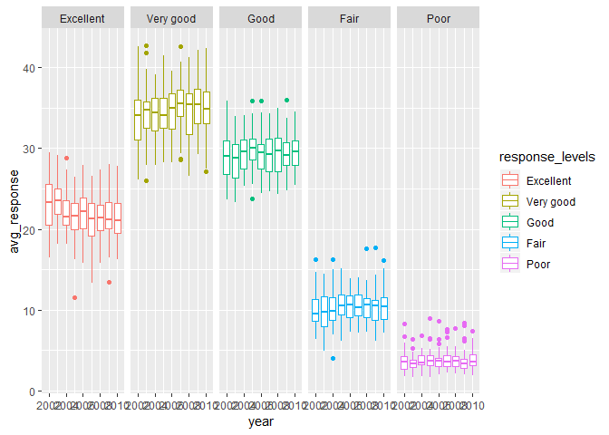

p8105\_HW3\_bjl2150
================
Briana Lettsome
October 15, 2018

``` r
# Loading of tidyverse package
library(tidyverse)
```

    ## -- Attaching packages --------------------------------------------------------------------------- tidyverse 1.2.1 --

    ## v ggplot2 3.0.0     v purrr   0.2.5
    ## v tibble  1.4.2     v dplyr   0.7.6
    ## v tidyr   0.8.1     v stringr 1.3.1
    ## v readr   1.1.1     v forcats 0.3.0

    ## -- Conflicts ------------------------------------------------------------------------------ tidyverse_conflicts() --
    ## x dplyr::filter() masks stats::filter()
    ## x dplyr::lag()    masks stats::lag()

Problem 1
=========

``` r
# install.packages("devtools")
devtools::install_github("p8105/p8105.datasets")
```

    ## Skipping install of 'p8105.datasets' from a github remote, the SHA1 (21f5ad1c) has not changed since last install.
    ##   Use `force = TRUE` to force installation

``` r
library(p8105.datasets)


data(brfss_smart2010)
  
brfss = brfss_smart2010 %>% 
  janitor::clean_names() %>%
  filter(topic == "Overall Health")

# Checked the unique observations within 'response' columns
unique(brfss$response)
```

    ## [1] "Excellent" "Very good" "Good"      "Fair"      "Poor"

``` r
# Ordering of the responses from "Excellent"" to "Poor"
brfss %>%
  mutate(response_levels = forcats::fct_relevel(response, c("Excellent", 
                                                            "Very good", "Good",
                                                            "Fair", "Poor"))) 
```

    ## # A tibble: 10,625 x 24
    ##     year locationabbr locationdesc class topic question response
    ##    <int> <chr>        <chr>        <chr> <chr> <chr>    <chr>   
    ##  1  2010 AL           AL - Jeffer~ Heal~ Over~ How is ~ Excelle~
    ##  2  2010 AL           AL - Jeffer~ Heal~ Over~ How is ~ Very go~
    ##  3  2010 AL           AL - Jeffer~ Heal~ Over~ How is ~ Good    
    ##  4  2010 AL           AL - Jeffer~ Heal~ Over~ How is ~ Fair    
    ##  5  2010 AL           AL - Jeffer~ Heal~ Over~ How is ~ Poor    
    ##  6  2010 AL           AL - Mobile~ Heal~ Over~ How is ~ Excelle~
    ##  7  2010 AL           AL - Mobile~ Heal~ Over~ How is ~ Very go~
    ##  8  2010 AL           AL - Mobile~ Heal~ Over~ How is ~ Good    
    ##  9  2010 AL           AL - Mobile~ Heal~ Over~ How is ~ Fair    
    ## 10  2010 AL           AL - Mobile~ Heal~ Over~ How is ~ Poor    
    ## # ... with 10,615 more rows, and 17 more variables: sample_size <int>,
    ## #   data_value <dbl>, confidence_limit_low <dbl>,
    ## #   confidence_limit_high <dbl>, display_order <int>,
    ## #   data_value_unit <chr>, data_value_type <chr>,
    ## #   data_value_footnote_symbol <chr>, data_value_footnote <chr>,
    ## #   data_source <chr>, class_id <chr>, topic_id <chr>, location_id <chr>,
    ## #   question_id <chr>, respid <chr>, geo_location <chr>,
    ## #   response_levels <fct>

``` r
#Wrangling dataframe to find the which states were observed at 7 locations
brfss_2002 = brfss %>%
  filter(year == 2002) %>%
  separate(locationdesc, into = c("state", "county"), sep = "-") %>%
  group_by(state) %>%
  distinct(county) %>%
  count() %>%
  filter(n == 7)
```

    ## Warning: Expected 2 pieces. Additional pieces discarded in 5 rows [121,
    ## 122, 123, 124, 125].

Conecticut, Florida and North Carolina are the states which were observed at 7 locations

Question 2: Making of Spaghetti Plot
------------------------------------

The following code was used to make the spaghetti plot showing the number of locations in each state from 2002 to 2012.

``` r
library(ggridges)
```

    ## 
    ## Attaching package: 'ggridges'

    ## The following object is masked from 'package:ggplot2':
    ## 
    ##     scale_discrete_manual

``` r
unique(brfss_smart2010$Year)
```

    ## [1] 2010 2009 2008 2007 2006 2005 2004 2003 2002

``` r
brfss_spaghetti = brfss %>%
  group_by(locationabbr, year) %>%
  distinct(locationdesc) %>%
  summarize(location_numbers = n()) %>%
  ggplot(aes(x = year, y = location_numbers, color = locationabbr)) + 
  geom_line()
```

### Question 3: Making of Table

``` r
brfss_table_1 = brfss %>%
    filter(locationabbr == "NY", response == "Excellent") %>%
  spread(key = response, value = data_value) %>%
  filter(year %in% c("2002", "2006", "2010")) 

# Making of the table to show means and standard deveiations
brfss_table_1 %>%
  group_by(year) %>%
  summarize(mean_excellent = mean(Excellent),
            sd_excellent = sd(Excellent)) %>%
   knitr::kable(digits = 1)
```

|  year|  mean\_excellent|  sd\_excellent|
|-----:|----------------:|--------------:|
|  2002|             24.0|            4.5|
|  2006|             22.5|            4.0|
|  2010|             22.7|            3.6|

### Question 4

``` r
brfss_4 = brfss %>%
  mutate(response_levels = forcats::fct_relevel(response, c("Excellent",  "Very good", "Good", "Fair", "Poor"))) %>%
  select(year, locationabbr, data_value, response_levels) %>%
  group_by(response_levels, locationabbr, year) %>%
  summarize(avg_response = mean(data_value))

brfss_4 %>%
    ggplot(aes(x = year, y = avg_response, group = year, color = response_levels)) +
  geom_boxplot() + 
  facet_grid(~response_levels) + 
  viridis::scale_fill_viridis(discrete = TRUE)
```

    ## Warning: Removed 21 rows containing non-finite values (stat_boxplot).



Problem 2
=========

Instacart dataset
-----------------

``` r
# Importing instacart dataset from p8105 datasets on github
devtools::install_github("p8105/p8105.datasets")
```

    ## Skipping install of 'p8105.datasets' from a github remote, the SHA1 (21f5ad1c) has not changed since last install.
    ##   Use `force = TRUE` to force installation

``` r
library(p8105.datasets)

data(instacart)

# Calling 'instacart' data into my environment and cleaning names

instacart = instacart %>% 
  janitor::clean_names()

# Used dim function to het the size of the dataset
dim(instacart)
```

    ## [1] 1384617      15

This dataset is from the delivery service Instacart. It shows observations ranging from proudct ID number and the hour of the day that a product was ordered to the product name and what aisle and department said product can be found in.

This dataset has 15 columns and 1,384,617 rows.

``` r
library(tidyverse)

# Answering how many aisles there are
instacart_1A = instacart %>%
  select(aisle) %>%
  distinct() %>%
  count()

# Answering which aisles are the most items ordered from
instacart_1B = instacart %>%
  select(product_name, aisle) %>% 
  count(aisle) %>% 
  arrange(desc(n))

# Problem 2 - Making of plot

# Problem 3 - Making table of most popular items

instacart_3B = instacart %>%
  select(aisle, product_name) %>% 
  group_by(aisle) %>%
  count(product_name) %>%
  arrange(desc(n)) %>%
  filter(aisle %in% c("baking ingredients", "dog food care", 
                      "packaged vegetables fruits"))  

  

  
# Problem 4 - Making table of mean hour of day for Pink Lady and Coffee Ice Cream

instacart_4 = instacart %>%
    select(order_hour_of_day, product_name, order_dow) %>%
    filter(product_name %in% c("Pink Lady Apples", "Coffee Ice Cream")) %>%
    group_by(order_dow, product_name) %>%
    summarize(mean_hour = mean(order_hour_of_day, na.rm = TRUE)) %>%
    spread(key = order_dow, value = mean_hour) %>% 
    knitr::kable(digits = 1)
```

There are 134 aisles in the instacart dataset.

The aisle with the most items ordered are fresh vegetables, fresh fruits, and packages vegetables fruits.

A table showing the mean hour of the day at which Pink Lady Apples and Coffee Ice Cream are ordered each day:

| product\_name    |     0|     1|     2|     3|     4|     5|     6|
|:-----------------|-----:|-----:|-----:|-----:|-----:|-----:|-----:|
| Coffee Ice Cream |  13.8|  14.3|  15.4|  15.3|  15.2|  12.3|  13.8|
| Pink Lady Apples |  13.4|  11.4|  11.7|  14.2|  11.6|  12.8|  11.9|

Problem 3
=========

``` r
devtools::install_github("p8105/p8105.datasets")
```

    ## Skipping install of 'p8105.datasets' from a github remote, the SHA1 (21f5ad1c) has not changed since last install.
    ##   Use `force = TRUE` to force installation

``` r
library(p8105.datasets)

data(ny_noaa)

ny_noaa = ny_noaa
```

### Short Description of dataset

This dataset is provided by the National Oceanic and Atmosperic Administration. This particular set includes information from the various weather stations throughout NY state. Some of the the variables included within this dataset are weather station ID, precipiation (mm), snow depth (mm), and minimum and maximum temperatures. One of the primary issues with this dataset is the large amount of missing data. Thus, it is difficlt to obtain an accurate measure of the variables, such as precipiation or snowfall (mm), from the various weather stations.

Problem 3.1
-----------

``` r
# Cleaning and separating 'date' into 'year', 'month', and 'day'. 
# Then selected "snow"

ny_noaa_1 = ny_noaa %>%
  janitor::clean_names() %>%
  separate(date, into = c("year", "month", "day"), sep = "-") %>%
  select(snow)

# Used the sort function in order to determine the most commonly observed valuy  
  sort(table(ny_noaa_1$snow), decreasing = TRUE) %>% View()
```

The most commonly observed value is 0 mm because, in the state of NY, it does not snow for more than half of the year (i.e. it snows for 4 to 5 months of the year). Based on this, 0 mm of snow should be the most frequent observations. The second and third commonly observed values are 25 and 13 mm as.

Problem 3.2
-----------

``` r
ny_noaa_2 = ny_noaa %>%
  janitor::clean_names() %>%
  separate(date, into = c("year", "month", "day"), sep = "-") %>%
  select(year, month, tmax, tmin, id) %>%
  group_by(year, id) 
```
